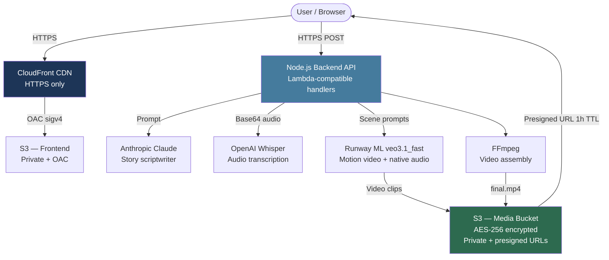
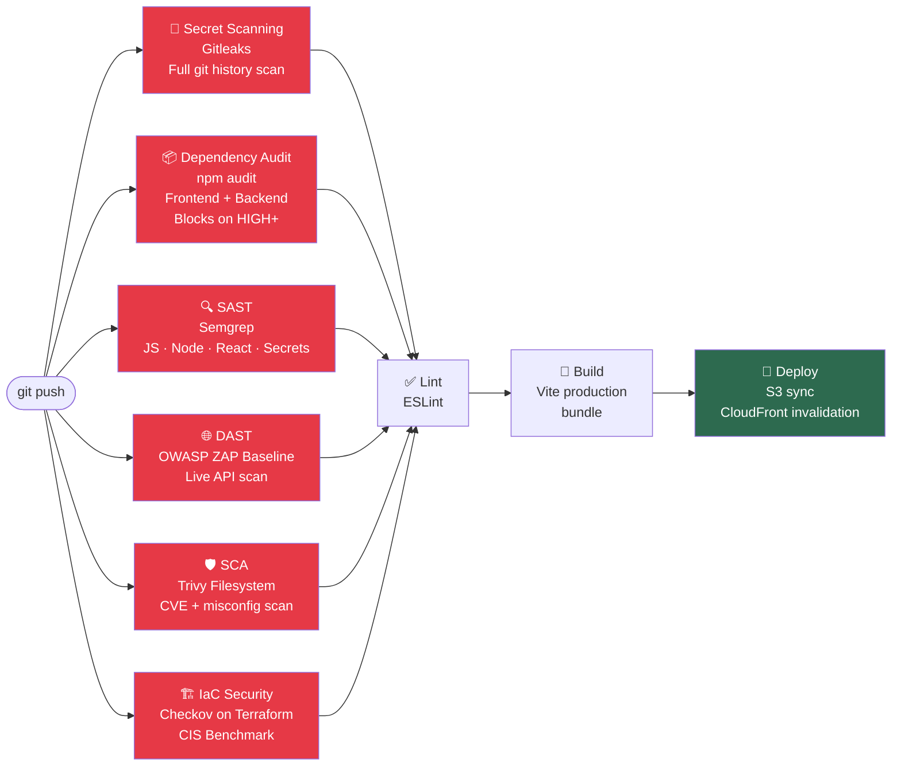

# StoryForge

**AI-powered animated story platform — built with a production-grade DevSecOps pipeline**

[](https://github.com/Cyb3rMoose/storyforge/actions/workflows/ci.yml)
[](https://github.com/Cyb3rMoose/storyforge/actions/workflows/deploy.yml)
[](https://github.com/Cyb3rMoose/storyforge/actions/workflows/terraform.yml)
[](https://github.com/gitleaks/gitleaks)
[](https://www.checkov.io/)

StoryForge lets users record or type a story prompt, which is then transformed into a short animated video using a chain of AI services: **Claude** for scriptwriting, **Runway ML** for motion video generation with native audio, and **FFmpeg** for final assembly. The result is delivered via a private AWS S3 bucket with presigned URLs enforcing Zero Trust access.

This repository demonstrates a **Secure SDLC** applied to a real, production AI application — embedding security tooling at every stage of the CI/CD pipeline, with Infrastructure as Code managed through Terraform.

> **Live demo:** [https://d2wsxozpwngfxe.cloudfront.net](https://d2wsxozpwngfxe.cloudfront.net)

---

## Architecture



---

## DevSecOps Pipeline

Security is enforced at every stage. The build will **not proceed** unless all security gates pass.



---

## Security Controls

| Layer | Control | Tool | Gate |
|---|---|---|---|
| **Secrets** | Hardcoded credential detection across full git history | Gitleaks | Blocks build |
| **Dependencies (Frontend)** | CVE audit on npm packages | npm audit | Blocks on HIGH+ |
| **Dependencies (Backend)** | CVE audit on backend npm packages | npm audit | Blocks on HIGH+ |
| **SAST** | Static analysis — JS, Node.js, React, secrets patterns | Semgrep | Blocks build |
| **DAST** | Baseline scan of live backend REST API | OWASP ZAP | Blocks on FAIL |
| **SCA / Filesystem** | CVE and misconfiguration scan of project files | Trivy | Blocks on HIGH+ |
| **IaC** | Terraform security policy enforcement (CIS Benchmark) | Checkov | Blocks on FAIL |
| **Code Quality** | ESLint — no unused vars, no unsafe refs | ESLint | Blocks build |
| **Transport** | HTTPS enforced at CloudFront — HTTP redirected | Terraform | Infrastructure |
| **Storage** | S3 buckets fully private — all public ACLs blocked | Terraform | Infrastructure |
| **Access** | Presigned URLs with 1-hour TTL for media delivery | AWS SDK | Runtime |
| **Encryption** | AES-256 server-side encryption on both S3 buckets | Terraform | Infrastructure |
| **IAM** | Least-privilege policies scoped per resource and action | Terraform | Infrastructure |
| **CDN** | CloudFront OAC (Origin Access Control) with SigV4 signing | Terraform | Infrastructure |

---

## AI Security

Integrating multiple AI providers introduces a distinct threat surface. See [docs/ai-security.md](docs/ai-security.md) for the full breakdown.

**Key controls applied:**

- **API key isolation** — Anthropic, OpenAI and Runway ML keys stored as GitHub Actions secrets and environment variables; never committed to source
- **Secret scanning** — Gitleaks scans full git history on every push to catch any accidental key exposure
- **Prompt injection mitigation** — user input is injected into a structured system prompt with explicit content instructions; raw user text is never executed as a top-level instruction
- **Input validation** — story prompts are length-capped and sanitised server-side before being forwarded to AI providers
- **Least-privilege AI calls** — each provider is called with the minimum required parameters; no admin or account-management API calls
- **Media access control** — AI-generated content stored in a private S3 bucket; served only via short-lived presigned URLs preventing public enumeration

---

## Threat Model

A full STRIDE threat model covering all components of the AI generation pipeline is documented in [docs/threat-model.md](docs/threat-model.md).

---

## Tech Stack

### Frontend
| Technology | Purpose |
|---|---|
| React 18 + Vite | SPA framework and build tooling |
| Zustand | Global state management |
| Web Audio API | In-browser audio recording |

### Backend
| Technology | Purpose |
|---|---|
| Node.js + Express | REST API (Lambda-compatible handlers) |
| Anthropic Claude (claude-haiku-4-5) | Story script generation |
| OpenAI Whisper (whisper-1) | Audio transcription |
| Runway ML (veo3.1_fast) | Motion video clips with native audio |
| FFmpeg (fluent-ffmpeg) | Video concatenation |
| AWS S3 | Media and frontend asset storage |
| AWS CloudFront | CDN with HTTPS enforcement |

### Infrastructure & Security
| Technology | Purpose |
|---|---|
| Terraform | Infrastructure as Code |
| GitHub Actions | CI/CD pipeline |
| Gitleaks | Secret scanning |
| Semgrep | SAST (JS/Node/React/secrets) |
| OWASP ZAP | DAST — live API scanning |
| Trivy | SCA — filesystem CVE scanning |
| Checkov | IaC security scanning |
| npm audit | Dependency vulnerability audit |

---

## Repository Structure

```
storyforge/
├── .github/
│   ├── workflows/
│   │   ├── ci.yml          # Security gates + lint + build
│   │   ├── deploy.yml      # S3 + CloudFront deployment
│   │   └── terraform.yml   # IaC validate + Checkov scan
│   └── dependabot.yml      # Automated dependency updates
├── backend/
│   ├── functions/
│   │   ├── generateScript/     # Claude story scriptwriter
│   │   ├── generateVideoClips/ # Runway ML video generation
│   │   ├── renderVideo/        # FFmpeg assembly
│   │   └── transcribeAudio/    # OpenAI Whisper
│   └── local-server.js         # Express dev server
├── docs/
│   ├── ai-security.md      # AI provider threat surface + controls
│   └── threat-model.md     # STRIDE threat model
├── src/
│   ├── api/storyforge.js   # Frontend API client
│   ├── components/         # React components
│   └── store/              # Zustand state
├── terraform/
│   ├── cloudfront.tf       # CDN with HTTPS enforcement
│   ├── iam.tf              # Least-privilege IAM policies
│   ├── s3.tf               # Private buckets + encryption
│   └── main.tf
└── .env.example            # Required environment variables
```

---

## Local Development

### Prerequisites
- Node.js 20+
- An `.env` file at the repo root (see `.env.example`)

### Required environment variables

```
ANTHROPIC_API_KEY=
OPENAI_API_KEY=
RUNWAYML_API_SECRET=
AWS_ACCESS_KEY_ID=
AWS_SECRET_ACCESS_KEY=
AWS_REGION=eu-west-2
AWS_S3_BUCKET=storyforge-media
```

### Run

```bash
# Install frontend dependencies
npm install

# Install backend dependencies
cd backend && npm install && cd ..

# Start backend (port 3001)
npm run dev:backend

# Start frontend (port 5173)
npm run dev
```

---

## Infrastructure

All AWS infrastructure is managed via Terraform in the `terraform/` directory.

**Resources provisioned:**
- S3 media bucket — AES-256 encrypted, fully private, lifecycle policy (auto-delete after N days)
- S3 frontend bucket — AES-256 encrypted, versioned, CloudFront OAC access only
- CloudFront distribution — HTTPS enforcement, SPA routing, asset cache headers
- IAM policies — scoped least-privilege per resource (media bucket, CloudFront invalidation, frontend deploy)

The Terraform workflow runs Checkov IaC scanning before any AWS credentials are configured, ensuring security policy validation is never skipped.

---

## Security Reporting

See [SECURITY.md](SECURITY.md) for responsible disclosure policy.
